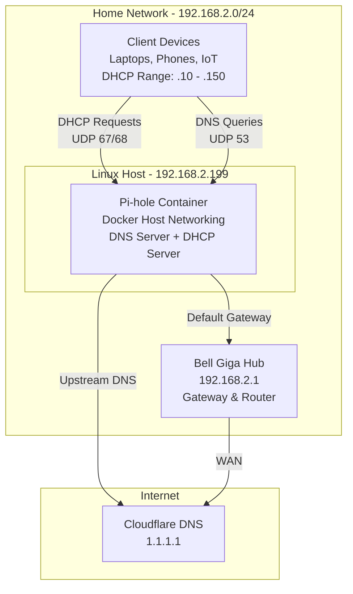

# Linux DHCP/DNS Migration: Docker Pi-hole Deployment

I moved IP assignment and DNS lookups off my ISP router (a Bell Hub) and onto a private Linux server. Two reasons: filter network traffic with a local DNS blocker (Pi-hole), and fix the occasional internet drops caused by the ISP router's firmware.

## System setup

- Host: Ubuntu 22.04 LTS
- Connection: Wired Ethernet
- Software: Docker Engine 24.0.5
- Services:
  - DNS: Pi-hole FTL (acts as a local caching forwarder)
  - DHCP: the embedded FTL/dnsmasq server
- Upstream DNS: Cloudflare (1.1.1.1)

## Network topology

## The router DNS loop

When I set the Bell Giga Hub's "Primary DNS" to my local Pi-hole server (`192.168.2.199`), the server immediately lost its internet connection.

Here is what was happening: the router likely has a security feature to prevent circular network loops. It isolates any LAN client designated as an upstream DNS server, cutting off its access to the WAN (Internet) and the Gateway.

The fix was a DHCP handover. Instead of asking the router to point clients at the Pi-hole, I completely disabled the router's ability to assign IPs, then enabled the DHCP server on the Linux host so it tells devices where to go for DNS directly, bypassing the router's logic.

## How it works

### Docker configuration

The container runs in `network_mode: "host"`. DHCP relies on broadcast packets (UDP ports 67 and 68), and those packets cannot easily pass through the Network Address Translation (NAT) used by Docker's default bridge network. The container needs direct access to the host's network interface.

### Migration steps

- Phase 1: Set up the Linux DHCP server with a safe IP range (`.10` - `.150`) that didn't overlap with existing devices.
- Phase 2: Disabled the DHCP service in Bell Gateway settings.
- Phase 3: Forced all devices to disconnect and reconnect (or power cycled them) so they would pull a fresh IP from the Linux server.

## Operating rules

- Power: the Linux server must always be on.
- Connection: Ethernet is required. I strongly recommend against running a DHCP server over Wi-Fi.

## Disaster recovery and failover

If the Linux host crashes or Docker fails, no device on the network gets an IP address. To cover that, the Bell Gateway is the designated standby DHCP server. If the Linux host or container fails, the network reverts to the Gateway's native DHCP service, which restores standard automatic IP assignment to devices.

## Results

- Reliability: 100% DNS resolution success rate for local devices.
- Capacity: automatically assigned IPs to 15+ devices, including IoT and mobile.
- Speed: in certain applications, DNS lookup times went from ~45ms (default) to under 15ms.

## Automating the DHCP failover

Right now, if my server breaks, I have to manually log into the Bell modem to turn its DHCP back on. The Bell modem has no API, so I can't send it commands via code.

If I upgraded to a router that allows API access (like a Cisco device), I would automate this with a simple script.

The watchdog idea:

I would run a Bash or PowerShell script on a second device, like a Raspberry Pi.

1. The check: ping my Linux server every 60 seconds to see if it's alive.
2. The trigger: if the server stops responding, the script sends an API command to the router.
3. The action: the router receives the command and turns on its own DHCP server.

That would get me near-100% uptime and resolve DHCP issues before anyone notices it went down.

## What I took from it

This project sat right between my university networking theory, my time as an enterprise IT support specialist, and real-world infrastructure constraints.

- The broadcast boundary: I learned firsthand why DHCP servers struggle on Wi-Fi (client isolation) and why wired Ethernet matters for infrastructure services. DHCP isn't magic; it needs a direct path for broadcast packets (UDP 67) that consumer hardware and firmware often block.
- Docker network isolation: moving from standard Docker bridges to `network_mode: "host"` made container isolation click. Isolation is good for security, but it breaks Layer 2 protocols like DHCP that need to hear the physical network.
- Troubleshooting method: isolating variables is the whole game with multi-layer tech. Telling a DNS failure (Application Layer) apart from a routing failure (Network Layer) was the key to cracking the router loop.
- Working around hardware limits: the Bell Hub firmware wouldn't support my config natively. Sometimes the proper enterprise approach isn't possible with consumer gear, and you engineer a reliable workaround with what you have.
- Security hygiene: kept secrets in `.env` files out of the repo instead of hardcoding them in the script.