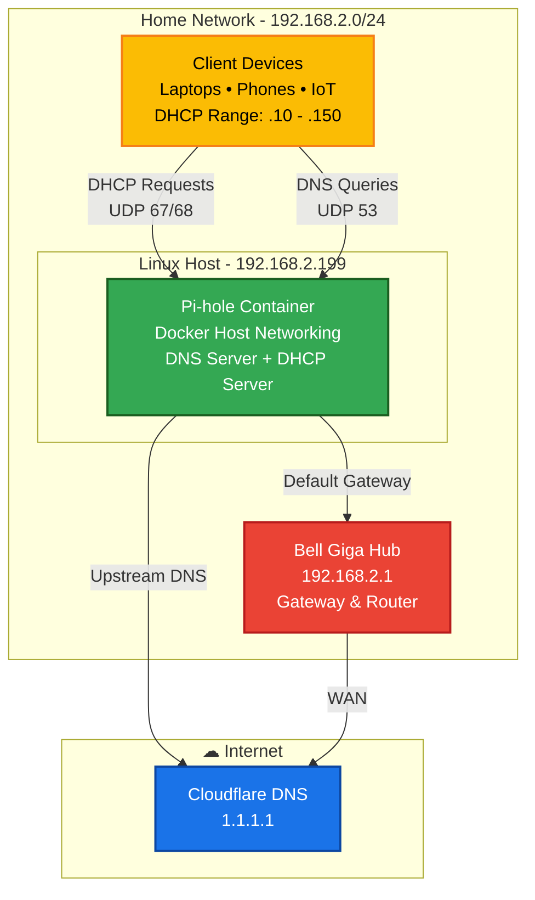

# Linux DHCP/DNS Migration: Docker Pi-hole Deployment

## What This Project Does
This project moves the responsibility for assigning IP addresses and looking up websites from my ISP-provided router (Bell Hub) to a private Linux server.

**The Goal:** To filter network traffic using a local DNS blocker (Pi-hole) and fix occasional internet connection drops caused by the ISP router's firmware.

## System Setup
* **Host Machine:** Ubuntu 22.04 LTS
* **Connection:** Wired Ethernet. 
* **Software:** Docker Engine 24.0.5.
* **Services:**
    * **DNS:** Pi-hole FTL (acts as a local caching forwarder).
    * **DHCP:** The embedded FTL/dnsmasq server.
* **Upstream DNS:** Cloudflare (1.1.1.1).

## Network Topology

## The Problem
**Observation:** When I set the Bell Giga Hub's "Primary DNS" to my local Pi-hole server (`192.168.2.199`), the server immediately lost its internet connection.

**Why this happens:** The router likely has a security feature to prevent circular network loops. It isolates any LAN client that is designated as an upstream DNS server, cutting off its access to the WAN (Internet) and the Gateway.

**The Fix:** I used a DHCP handover strategy. Instead of asking the router to point clients to the Pi-hole, I completely disabled the router's ability to assign IPs. I then enabled the DHCP server on the Linux host so it can tell devices where to go for DNS directly, bypassing the router's logic.

## Technical Setup

### 1. Docker Configuration
The container must run in `network_mode: "host"`.

* **Reason:** DHCP relies on broadcast packets (UDP ports 67 and 68). These packets cannot easily pass through the Network Address Translation (NAT) used by Docker's default bridge network. The container needs direct access to the host's network interface.

### 2. Migration Steps
* **Phase 1:** I set up the Linux DHCP server with a safe IP range (`.10` - `.150`) that didn't overlap with existing devices.
* **Phase 2:** I disabled the DHCP service in Bell Gateway settings.
* **Phase 3:** I forced all devices to disconnect and reconnect (or power cycled them) so they would get a fresh IP address from the Linux server.

## Rules
* **Power:** The Linux server must always be on.
* **Connection:** Ethernet connection is required. I strongly recommend against using Wi-Fi for a DHCP server.

## Disaster Recovery & Failover
**Risk:** If the Linux host crashes or Docker fails, no device on the network will get an IP address.

**Backup Strategy:** The Bell Gateway acts as the designated standby DHCP server.

**Recovery Protocol:** If the Linux host or container fails, the network is designed to revert to the Gateway's native DHCP service. This restores standard automatic IP assignment to devices. 

## Observations
* **Reliability:** 100% DNS resolution success rate for local devices.
* **Capacity:** Automatically assigned IPs to 15+ devices (including IoT and mobile devices).
* **Speed:** In certain applications, DNS lookup times went from ~45ms (default) to under 15ms.

## Future Improvements: Automating the DHCP Failover

Right now, if my server breaks, I have to manually log into the Bell modem to turn its DHCP back on. This is because the Bell modem doesn't have an API (I can't send it commands via code).

If I upgraded to a router that allows API access (like a Cisco device), I would automate this with a simple script.

**The "Watchdog" Script Idea:**
I would write a Bash or PowerShell script running on a second device (like a Raspberry Pi).

1.  **The Check:** The script pings my Linux server every 60 seconds to see if it's alive.
2.  **The Trigger:** If the server stops responding, the script sends an API command to the router.
3.  **The Action:** The router receives the command and immediately turns on its own DHCP server.

This would ensure near-100% uptime, and resolve any DHCP issues before anyone even notices it went down.

## Key Takeaways
This project bridged the gap between my university networking theory, my experience working as an enterprise IT support specialist,  and real-world infrastructure constraints.

* **The "Broadcast Boundary":** I learned firsthand why DHCP servers struggle on Wi-Fi (client isolation) and why wired Ethernet is critical for infrastructure services. DHCP isn't magic; it requires a direct path for broadcast packets (UDP 67) that consumer hardware (or firmware) often blocks.
* **Docker Network Isolation:** Moving from standard Docker bridges to `network_mode: "host"` clarified how container isolation works. I learned that while isolation is good for security, it breaks Layer 2 protocols like DHCP that need to "hear" the physical network.
* **Troubleshooting Methodology:** Isolating variables is critical for any technology with multiple layers. Distinguishing between a **DNS failure** (Application Layer) and a **Routing failure** (Network Layer) was the key to solving the router loop issue.
* **Working Around Hardware Limits:** The Bell Hub firmware wouldn't support my configuration natively. This taught me that sometimes "proper" enterprise solutions aren't possible with consumer gear, and you have to engineer a reliable workaround using the tools you have.
* **Security Hygiene:** Kept secrets in `.env` files out of the repo instead of hardcoding them in the script.